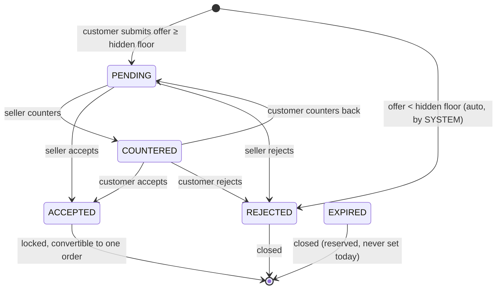
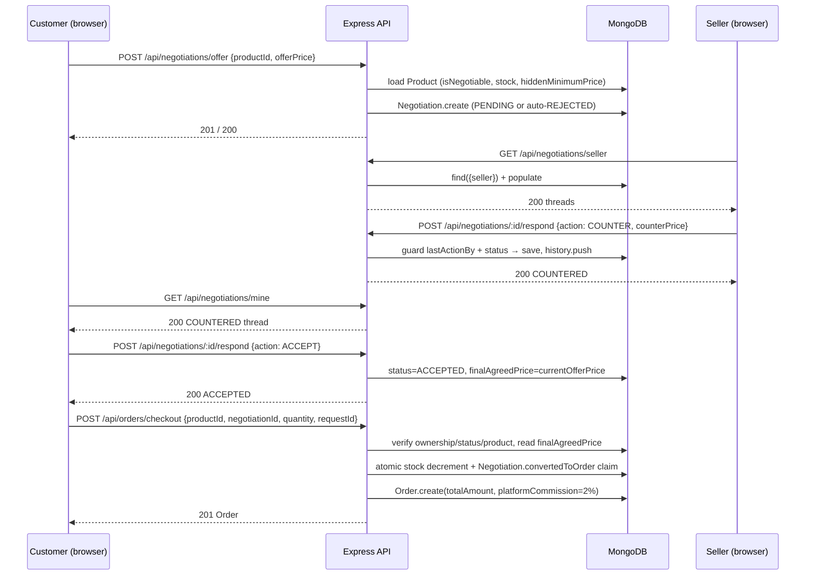

# NearDeal — Smart Bargaining Workflow

The complete negotiation flow as implemented in
`backend/controllers/negotiationController.js` and consumed by
`frontend/src/pages/customer/Negotiations.jsx`,
`frontend/src/pages/seller/Negotiations.jsx` and
`frontend/src/components/bargaining/BargainingModal.jsx`.

---

## 1. The state machine



| Status | Meaning | Who acts next |
| --- | --- | --- |
| `PENDING` | Offer opened, awaiting the other side | Seller |
| `COUNTERED` | A counter-offer is on the table | The side that did **not** counter |
| `ACCEPTED` | Price settled and locked | Customer → checkout |
| `REJECTED` | Declined, either by a party or automatically | Nobody — closed |
| `EXPIRED` | Reserved for future use — **never set by current code** | — |

`lastActionBy` records who moved last. It is the mechanism that makes it
impossible for one party to respond to its own offer.

---

## 2. Step-by-step flow

### Step 1 — Customer opens a product

`GET /api/products/:id` (public, with `optionalAuth`). The detail page shows
**Buy Now** always, and **Negotiate Price** only when `isNegotiable` is true.

### Step 2 — Customer submits an offer

`POST /api/negotiations/offer` — `protect` + `authorize('CUSTOMER')`.

Request body:

```json
{ "productId": "<id>", "offerPrice": 24000, "quantity": 1 }
```

Server-side validation, in order:

| Check | Result |
| --- | --- |
| `productId` is a valid ObjectId | `400` |
| `offerPrice` is a finite number > 0 | `400` |
| Product exists and `status === 'ACTIVE'` | `404` |
| `product.isNegotiable` is true | `400` "not open for negotiation" |
| `product.stock >= quantity` | `409` insufficient stock |
| Product is not the caller's own listing | `400` |
| No other active thread for this customer + product | `409` |

Then the **hidden floor test**:

```
if (offerPrice < product.hiddenMinimumPrice)
    status = 'REJECTED',  lastActionBy = 'SYSTEM'
```

- Below the floor → the thread is created **already `REJECTED`**, a `SYSTEM`
  entry is appended to `history`, and the API answers `200` with
  *"Offer was too low and automatically rejected"*. The seller never sees it.
- At or above the floor → created as `PENDING` with `201`.

On creation the thread snapshots `listedPrice` (= `Product.price`),
`initialOfferPrice` and `quantity`.

### Step 3 — Seller sees their own negotiations

`GET /api/negotiations/seller` — `protect` + `authorize('SELLER')`.

Returns every negotiation whose `seller` is the caller, newest first, with
`product`, `customer` and `seller` populated. The customer's counterpart view
is `GET /api/negotiations/mine` — `protect` + `authorize('CUSTOMER')`.

Both screens read the API on every load; nothing is mirrored to
`localStorage`.

### Step 4 — Seller responds

`POST /api/negotiations/:id/respond` — `protect`, open to both parties.

Request body:

```json
{ "action": "ACCEPT" | "REJECT" | "COUNTER", "counterPrice": 26000 }
```

Guard rails:

| Check | Status |
| --- | --- |
| Valid negotiation id, document exists | `404` |
| Caller is the thread's `customer` **or** `seller` | `403` |
| Thread not already `ACCEPTED` / `REJECTED` / `EXPIRED` | `409` "already closed" |
| Caller is not `lastActionBy` (cannot answer yourself) | `409` |
| `COUNTER` carries a finite price > 0 | `400` |

Outcome:

- **`ACCEPT`** → `status = 'ACCEPTED'` **and**
  `finalAgreedPrice = currentOfferPrice`. The settlement is recorded on the
  thread itself so checkout can be reconciled against it.
- **`REJECT`** → `status = 'REJECTED'`.
- **`COUNTER`** → `status = 'COUNTERED'`, `currentOfferPrice = counterPrice`,
  so the other side now reacts to the new number.

Every response appends `{offerPrice, actionBy, status, timestamp}` to
`history`, giving an auditable turn-by-turn record.

### Step 5 — Customer sees the updated status

The customer's `/negotiations` screen reflects the new status on the next
load: a `COUNTERED` thread offers **Accept / Reject / Counter**, an `ACCEPTED`
thread offers **Proceed to checkout**.

### Step 6 — Accepted thread goes to checkout

`POST /api/orders/checkout` — `protect` + `authorize('CUSTOMER')`, with
`negotiationId` included.

The order controller re-validates everything:

| Check | Status |
| --- | --- |
| Negotiation belongs to the caller | `403` |
| Negotiation `status === 'ACCEPTED'` | `409` |
| `convertedToOrder` is still unset (one deal → one order) | `409` |
| Negotiation's product matches `productId` | `400` |
| Stock available | `409` |

### Step 7 — Server-side price verification

The price the customer pays is **read from the document of record**:

```js
finalPrice = negotiation.finalAgreedPrice ?? negotiation.currentOfferPrice;
```

Whatever price the browser believes it agreed is ignored. Then:

```
totalAmount        = finalPrice × quantity
platformCommission = round(totalAmount × 0.02, 2)   // seller's fee, stored separately
```

Stock is decremented atomically with a `stock >= quantity` predicate, and
`Negotiation.convertedToOrder` is claimed atomically so a replay cannot bill
the bargain twice.

### Step 8 — Order created

`201` with the `Order` document, `isNegotiated: true`, `status: 'PENDING'`.

The seller advances it through
`PENDING → PAID → PROCESSING → COMPLETED` (or `→ CANCELLED`, which returns the
reserved stock).

---

## 3. Sequence diagram



---

## 4. Frontend behaviour

| Screen | File | Role |
| --- | --- | --- |
| Bargaining modal | `components/bargaining/BargainingModal.jsx` | Enter an offer, see listed price vs offer |
| Customer threads | `pages/customer/Negotiations.jsx` | Track offers, respond to counters |
| Seller queue | `pages/seller/Negotiations.jsx` | Accept / decline / counter incoming offers |
| Seller overview | `pages/seller/SellerDashboard.jsx` | Pending-offer counters inline |
| Product detail | `pages/customer/ProductDetails.jsx` | Shows live thread state next to Buy/Negotiate |

Cart lines created from an accepted bargain carry the agreed price, and
`reconcileCartWithNegotiations()` keeps the bag consistent with the latest
negotiation state so the badge and the `negotiationId` sent to checkout can
never disagree.

---

## 5. Design decisions worth knowing

**Why the floor is hidden.** `hiddenMinimumPrice` is never returned to the
buyer. Auto-rejection happens server-side, so a customer cannot probe the floor
by watching the network response — they only see "rejected".

**Why only one active thread per pairing.** Two simultaneous threads over the
same product could both reach `ACCEPTED` and both try to reserve stock. A
second attempt is a `409`, not a new document.

**Why `listedPrice` is snapshotted.** Sellers edit prices. The thread, the
order display and the admin `averageDiscountRate` all need the price the deal
actually started from.

**Why `lastActionBy` exists.** Without it a customer could `ACCEPT` their own
fresh offer and buy at a price the seller never agreed to.

**Why conversion is claimed atomically.** A double-clicked checkout would
otherwise reserve stock and bill twice. The `convertedToOrder` field moves from
`null` to the order id in a single `findOneAndUpdate`; the loser rolls back.

---

## 6. Known limitations in this flow

- **No real-time push.** Neither side is notified while the page is open —
  threads refresh on navigation/ reload. There is no polling interval,
  WebSocket or server-sent event.
- **`EXPIRED` is never assigned.** The status exists and is handled on read,
  but no timer or code path sets it, so threads never expire.
- **No in-thread chat.** Communication is limited to price offers and counters.

See [`Project_Report.md`](Project_Report.md) § *Current Implementation Status*
for the full implemented / partial / planned breakdown.
