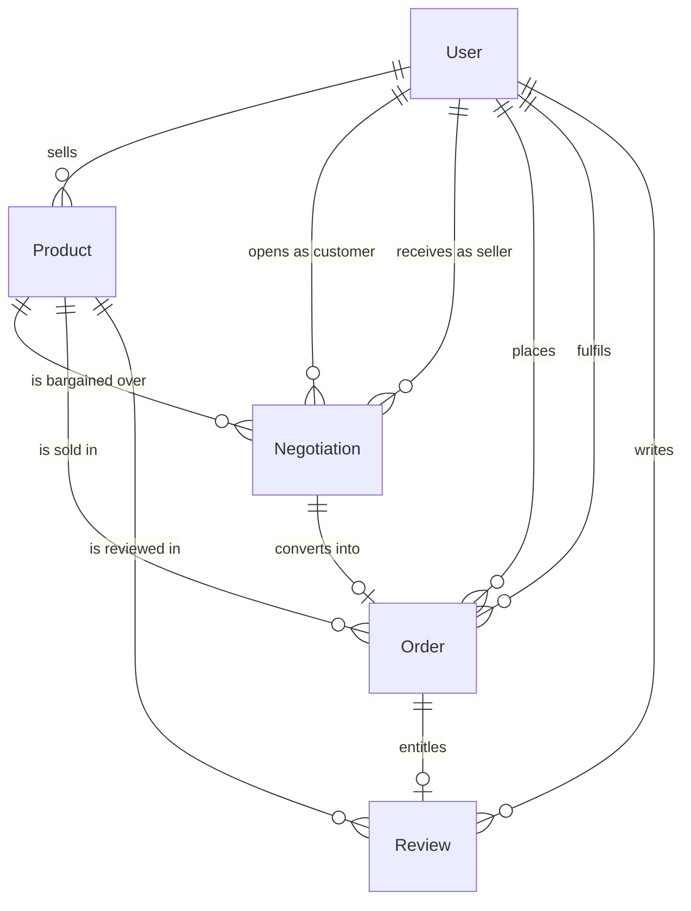

# NearDeal — Database Design

Based on the real Mongoose schemas in `backend/models/`.

**Database:** MongoDB, accessed through Mongoose 8.
**Collections:** `users`, `products`, `negotiations`, `orders`, `reviews`
(Mongoose pluralises the lower-cased model name).

No sample records, connection strings or credentials are included here.

---

## 1. Entity relationship overview



| Model | File | Purpose |
| --- | --- | --- |
| `User` | `models/User.js` | Every account: customer, seller and admin |
| `Product` | `models/Product.js` | A seller's listing, with geo position and stock |
| `Negotiation` | `models/Negotiation.js` | One bargaining thread over one product |
| `Order` | `models/Order.js` | A completed checkout, with commission |
| `Review` | `models/Review.js` | A purchase-verified, moderated opinion |

---

## 2. `User`

**Purpose:** single collection for all three roles; seller-only fields are
optional and simply absent on customers.

| Field | Type | Notes |
| --- | --- | --- |
| `name` | String, required | Display name |
| `email` | String, required, **unique**, regex-validated | Login identity |
| `password` | String, min 6, **`select: false`** | bcrypt hash; never returned by queries |
| `role` | enum `CUSTOMER` \| `SELLER` \| `ADMIN`, default `CUSTOMER` | Authorisation source of truth |
| `status` | enum `ACTIVE` \| `SUSPENDED`, default `ACTIVE` | Re-checked on **every** protected request |
| `location` | GeoJSON Point, `coordinates: [lng, lat]` with a **2dsphere** index | Seller's position; used for proximity metrics |
| `businessName` | String, optional | Store name shown in the UI |
| `isVerifiedSeller` | Boolean, default `false` | Display flag — see limitations |
| `rating` | Number, default `0` | Denormalised average of **approved** reviews, rounded to 1 dp |
| `createdAt` / `updatedAt` | Date | From `timestamps: true` |

**Indexes:** unique on `email`, `2dsphere` on `location.coordinates`.

**Business rules:**

- A `pre('save')` hook hashes the password with bcrypt (10 salt rounds) only
  when the field changed.
- `matchPassword()` wraps `bcrypt.compare`.
- `User.rating` is **never** set by a client; `reviewController` recomputes it
  from `APPROVED` reviews whenever moderation changes a review's status.

---

## 3. `Product`

**Purpose:** a listing owned by one seller, positioned geographically.

| Field | Type | Notes |
| --- | --- | --- |
| `seller` | ObjectId → `User`, required | Owner |
| `name` | String, required | 3–120 chars (controller validation) |
| `category` | String, required | One of 7 canonical categories |
| `description` | String, required | 10–2000 chars |
| `price` | Number, required, ≥ 0 | Listed ("list") price |
| `stock` | Number, required, ≥ 0 | Decremented atomically at checkout |
| `isNegotiable` | Boolean, default `true` | Gates whether offers are accepted |
| `hiddenMinimumPrice` | Number, optional, ≥ 0 | Private floor; **must be below `price`** |
| `images` | `[String]`, default `[]` | Max 6 `http(s)` URLs |
| `location` | GeoJSON Point, `[lng, lat]`, **2dsphere** index | Listing position |
| `status` | enum `ACTIVE` \| `INACTIVE`, default `ACTIVE` | Soft delete / delist |
| `createdAt` / `updatedAt` | Date | `timestamps: true` |

**Canonical categories:**
`Living Room`, `Bedroom`, `Dining Room`, `Office Furniture`,
`Outdoor Furniture`, `Storage & Cabinets`, `Decor & Furnishings`.
Legacy aliases (`living`, `office`, `home decor`, …) are normalised on write
and on read.

**Business rules:**

- `hiddenMinimumPrice` must be strictly lower than the selling price — the
  seller cannot set a floor at or above the list price.
- Deleting a product sets `status: 'INACTIVE'`; the document is kept because
  orders and negotiations reference it.
- Stock reaching `0` at checkout flips the listing to `INACTIVE`
  automatically; a cancellation that restores stock flips it back.

**Indexes:** `2dsphere` on `location.coordinates`.

---

## 4. `Negotiation` — the bargaining thread

**Purpose:** one document per customer↔product bargaining conversation,
carrying the full offer history.

| Field | Type | Notes |
| --- | --- | --- |
| `product` | ObjectId → `Product`, required | What is being bargained over |
| `customer` | ObjectId → `User`, required | Who opened the offer |
| `seller` | ObjectId → `User`, required | Who must respond |
| `listedPrice` | Number | Snapshot of `Product.price` when the offer opened |
| `initialOfferPrice` | Number | The customer's first proposal |
| `finalAgreedPrice` | Number | Set **only** when status becomes `ACCEPTED` |
| `currentOfferPrice` | Number, required | The live proposal both sides are reacting to |
| `quantity` | Number, default 1, min 1 | Units the deal covers |
| `convertedToOrder` | ObjectId → `Order`, default `null` | One-time conversion guard |
| `lastActionBy` | enum `CUSTOMER` \| `SELLER` \| `SYSTEM`, required | Prevents a party answering itself |
| `status` | enum `PENDING` \| `COUNTERED` \| `ACCEPTED` \| `REJECTED` \| `EXPIRED` | State machine |
| `history[]` | `{offerPrice, actionBy, status, timestamp}` | Append-only audit trail |
| `createdAt` / `updatedAt` | Date | `timestamps: true` |

**Why `listedPrice` is snapshotted:** the seller may edit the product's price
later; the thread must keep showing the price the two sides actually bargained
from. The same snapshot feeds the admin `averageDiscountRate` metric.

**Business rules:**

- At most **one** active thread (`PENDING`, `COUNTERED` or `ACCEPTED`) per
  customer per product — a second attempt returns `409`.
- An offer below `hiddenMinimumPrice` is created directly as `REJECTED` with
  `lastActionBy: 'SYSTEM'`.
- `convertedToOrder` is claimed atomically; once set, the deal can never become
  a second order.
- `EXPIRED` exists in the enum and is handled defensively, but **no code path
  currently sets it** (see limitations).

---

## 5. `Order`

**Purpose:** the financial record of a checkout, including the platform fee.

| Field | Type | Notes |
| --- | --- | --- |
| `customer` | ObjectId → `User`, required | Buyer |
| `seller` | ObjectId → `User`, required | Fulfilment store |
| `product` | ObjectId → `Product`, required | Item purchased |
| `negotiation` | ObjectId → `Negotiation`, optional | Present only for bargained purchases |
| `listPrice` | Number | `Product.price` at purchase time |
| `isNegotiated` | Boolean, default `false` | Whether the price came from a bargain |
| `finalAgreedPrice` | Number, required | **Per unit** — list price, or the agreed price |
| `quantity` | Number, required, min 1 | Units |
| `totalAmount` | Number, required | `finalAgreedPrice × quantity` |
| `platformCommission` | Number, required | **2% of `totalAmount`** — the seller's fee |
| `requestId` | String, **unique + sparse** index | Idempotency key per checkout submission |
| `status` | enum `PENDING` \| `PAID` \| `PROCESSING` \| `COMPLETED` \| `CANCELLED` | Lifecycle |
| `paymentMethod` | String, default `CASH_ON_DELIVERY` | `CASH_ON_DELIVERY` or `ONLINE` |
| `createdAt` / `updatedAt` | Date | `timestamps: true` |

**Business rules:**

- The price is read from `negotiation.finalAgreedPrice` — never from the
  request body.
- `platformCommission` is stored separately and is **never** added to what the
  customer pays.
- Cancellation returns `quantity` units to `Product.stock`.
- Both payment methods start as `PENDING` because no payment provider is wired.

---

## 6. `Review`

**Purpose:** a purchase-verified opinion that passes through moderation.

| Field | Type | Notes |
| --- | --- | --- |
| `product` | ObjectId → `Product`, required | Item reviewed |
| `seller` | ObjectId → `User`, required | Denormalised owner, for rating maths |
| `customer` | ObjectId → `User`, required | Author |
| `order` | ObjectId → `Order` | The purchase that entitled the review |
| `rating` | Integer, required, 1–5 | Whole numbers only |
| `comment` | String, required, ≤ 500 chars | |
| `status` | enum `PENDING` \| `APPROVED` \| `REJECTED`, default `PENDING` | Moderation state |
| `createdAt` / `updatedAt` | Date | `timestamps: true` |

**Indexes:** **unique** on `{product, customer}` — one opinion per customer per
product; a duplicate submit is a `409`.

**Business rules:**

- The author must have a non-cancelled order for that product — proven by
  querying the order book, not by trusting the browser.
- Only `APPROVED` reviews are returned publicly and counted toward the seller's
  `User.rating`.
- Moderation changes trigger `recalculateSellerRating()`.

---

## 7. The end-to-end data chain

How one bargain becomes a paid order and a platform commission:

```
CUSTOMER                        MONGODB                              SELLER
────────                        ───────                              ──────
browse catalogue   →  Product (status ACTIVE, stock > 0, geo within radius)
open an offer      →  Negotiation {
                        product, customer, seller,
                        listedPrice   ← Product.price snapshot,
                        currentOfferPrice,
                        history[0]
                      }  status PENDING
                                ←─────── respond ACCEPT / COUNTER / REJECT
if ACCEPTED        →  Negotiation.status = ACCEPTED
                        finalAgreedPrice = currentOfferPrice
checkout           →  Order {
                        finalAgreedPrice ← Negotiation.finalAgreedPrice,
                        listPrice        ← Product.price,
                        quantity,
                        totalAmount      = finalAgreedPrice × quantity,
                        platformCommission = totalAmount × 0.02,
                        isNegotiated: true,
                        negotiation
                      }
                     Product.stock  ← stock − quantity   (atomic)
                     Negotiation.convertedToOrder ← Order._id (atomic)
                                ───────→  seller advances status
                                          PENDING → PAID → PROCESSING → COMPLETED
```

Commission example (per unit price `₹27,000`, quantity 1):

| | Amount |
| --- | --- |
| `listPrice` | ₹30,000 |
| `finalAgreedPrice` | ₹27,000 |
| `totalAmount` | ₹27,000 |
| `platformCommission` (2%) | ₹540 |

`totalPlatformCommission` on the admin dashboard is the sum of
`platformCommission` across non-cancelled orders — it is aggregated in MongoDB,
never recomputed in the browser.

---

## 8. Index and integrity summary

| Collection | Index | Why |
| --- | --- | --- |
| `users` | unique `email` | One account per address |
| `users` | `2dsphere` `location.coordinates` | Proximity queries |
| `products` | `2dsphere` `location.coordinates` | `$geoWithin $centerSphere` radius filter |
| `orders` | unique sparse `requestId` | Checkout idempotency |
| `reviews` | unique `{product, customer}` | One review per customer per product |

Referential integrity is enforced in the application layer rather than by
foreign keys (MongoDB has none): controllers verify ownership and existence
before every write, and `populate()` resolves references for responses.

---

## 9. Related documents

- [`System_Architecture.md`](System_Architecture.md) — how the layers use these models
- [`Bargaining_Workflow.md`](Bargaining_Workflow.md) — the negotiation state machine
- [`API_Documentation.md`](API_Documentation.md) — endpoints that read and write these collections
