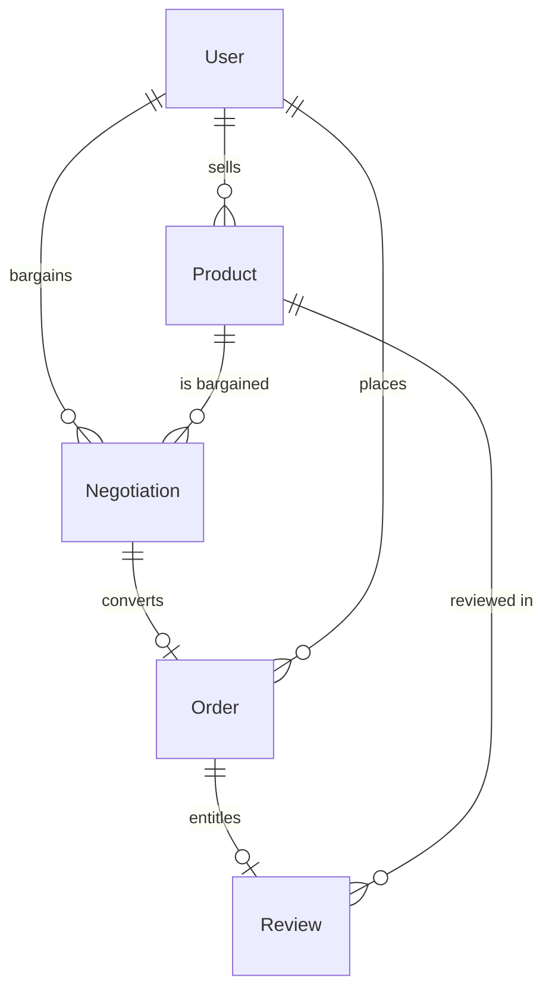

# NearDeal — Project Report

---

## 1. Project Title

**NearDeal — Local Commerce & Smart Bargaining Platform**
*Search Local. Bargain Better. Find Nearby. Make the Deal.*

---

## 2. Project Overview

NearDeal is a location-based online marketplace that connects customers with
nearby local sellers and adds something ordinary e-commerce sites do not offer:
**a real, multi-turn price negotiation built into the buying flow**.

A customer searches for a product near them, compares listings by price,
distance and seller rating, and then either buys at the listed price or opens a
bargaining thread. The seller accepts, declines or counters. Once both sides
agree, the negotiated price is locked and the customer checks out at exactly
that price. The platform earns a flat **2% commission charged to the seller**
on completed transactions — never to the customer.

The application is a full-stack MERN build:

| Layer | Technology |
| --- | --- |
| Frontend | React 19 + Vite, React Router |
| Backend | Node.js + Express 4 REST API |
| Database | MongoDB with Mongoose 8 |
| Authentication | JWT + bcrypt, three roles |

The repository contains both applications plus this documentation set.

---

## 3. Problem Statement

Buying furniture and household goods locally is slow and opaque. A customer
typically has to:

- visit several stores in person;
- call different sellers just to ask prices;
- compare products, conditions and prices by hand;
- judge whether a quoted price is actually reasonable;
- assess seller reputation from nothing more than a hunch;
- negotiate separately, in person, with each shop;
- travel between stores to do all of the above.

Sellers face the mirror problem: a shop with good prices and good stock is
invisible to anyone who does not already walk past it, and there is no
affordable channel to reach nearby buyers.

Meanwhile, conventional e-commerce fixes prices. `Search → Buy` gives the
customer no structured way to bargain, and gives local merchants no way to
compete on price without publicly slashing their listed rate.

---

## 4. Proposed Solution

NearDeal combines local discovery with a formal bargaining mechanism:

```
Search → Find Nearby → Negotiate → Buy → Review
```

For each listing the platform surfaces the information a local purchase
actually depends on: product name, images, price, seller name, seller rating,
product reviews, straight-line distance, availability and whether bargaining
is open.

The negotiation itself is a first-class, persisted workflow — not a contact
form. Offers, counter-offers and outcomes are stored as an auditable thread,
and the agreed price flows into checkout server-side so the customer can never
be charged a number the seller did not accept.

---

## 5. Objectives

1. Let customers find products available within a configurable radius of their
   location, with honest straight-line distances.
2. Provide transparent comparison across price, distance, rating and
   negotiation availability.
3. Replace informal bargaining with a structured, persisted, multi-turn
   negotiation state machine.
4. Give sellers a self-service storefront: listings, inventory, incoming offers
   and order fulfilment.
5. Give the platform operator live visibility into volume, commission and
   local supply.
6. Charge no commission to the customer and a single, predictable 2% to the
   seller.
7. Keep the system secure: role-based authorisation, hashed passwords,
   server-side price verification and abuse protection.
8. Ship as a runnable, verifiable full-stack application rather than a demo
   with mocked data.

---

## 6. Target Users

| Persona | What they get |
| --- | --- |
| **Customers** | Discover nearby products, read ratings, bargain for a fair price, buy locally, track orders |
| **Local sellers** | Reach nearby customers, list inventory online, respond to offers digitally, build a reputation, manage orders |
| **Platform administrators** | Oversee accounts, listings, orders, reviews and the commission earned |

---

## 7. Key Features

| Area | Feature | Status |
| --- | --- | --- |
| Discovery | Geo-filtered catalogue (`$centerSphere`, configurable radius up to 50 km) | ✅ Implemented |
| Discovery | Haversine straight-line distance shown on every card | ✅ Implemented |
| Discovery | Search, category, price range, minimum rating, negotiable-only filters | ✅ Implemented |
| Discovery | Sorting: relevance, newest, price asc/desc, nearest, seller rating | ✅ Implemented |
| Discovery | Pagination with total/page metadata | ✅ Implemented |
| Auth | Register/login, JWT sessions, profile & location updates | ✅ Implemented |
| Auth | Three roles with server-side RBAC | ✅ Implemented |
| Auth | Account suspension enforced on every request | ✅ Implemented |
| Bargaining | Offer → accept / decline / counter state machine | ✅ Implemented |
| Bargaining | Hidden minimum price with automatic server-side rejection | ✅ Implemented |
| Bargaining | Full append-only offer history per thread | ✅ Implemented |
| Bargaining | One active thread per customer per product | ✅ Implemented |
| Catalogue | Seller CRUD, soft-delete, negotiable toggle, private floor | ✅ Implemented |
| Catalogue | 7 canonical categories with legacy alias normalisation | ✅ Implemented |
| Cart | Client-side cart with quantities, carried negotiated prices | ✅ Implemented |
| Checkout | Idempotent single-line checkout, atomic stock reservation | ✅ Implemented |
| Orders | 5-state lifecycle with server-validated transitions | ✅ Implemented |
| Orders | Cancellation restores reserved stock | ✅ Implemented |
| Reviews | Purchase-verified submissions, moderation queue | ✅ Implemented (API) |
| Reviews | Seller rating recomputed from approved reviews | ✅ Implemented |
| Admin | Live KPI metrics, user/product/order/review moderation | ✅ Implemented |
| Security | helmet, CORS allow-list, 256 KB body cap, auth rate limiting | ✅ Implemented |
| Health | `/api/health` reflecting real DB connectivity | ✅ Implemented |
| Reviews | Customer-facing submit and display UI | ⚠️ Not built |
| Real-time | Live negotiation updates without refresh | ⚠️ Partial — refresh on load |
| Media | Image upload to cloud storage | ❌ Planned (URLs only) |
| Payments | Payment gateway integration | ❌ Planned (enum only) |
| Notifications | E-mail/push/in-app notifications | ❌ Planned |
| Chat | In-thread buyer–seller messaging | ❌ Planned |

---

## 8. Customer Workflow

1. Land on the home page — hero, radius control and a "Furniture Near You"
   section.
2. Search or filter the catalogue by category, price, distance, rating and
   negotiation availability.
3. Open a product to see images, seller card, rating, distance and stock.
4. Choose **Buy Now**, or **Negotiate Price** when `isNegotiable` is true.
5. Submit an offer; the bargaining modal shows listed price against offer.
6. Track the thread on `/negotiations` — accept a counter, or counter again.
7. Once accepted, add to cart at the agreed price.
8. Checkout: quantity, payment method and delivery/pickup details.
9. Track the order on `/orders` as the seller advances its status.

---

## 9. Seller Workflow

1. Register as a `SELLER` with a store name.
2. Set the store's geographic location (required for proximity metrics).
3. Create listings: name, category, description, price, stock, image URLs,
   negotiation on/off and an optional hidden minimum price.
4. Manage inventory from the dashboard — edit, or hide/publish a listing.
5. Review incoming offers and **Accept**, **Decline** or **Counter**.
6. Fulfil orders: `Payment Pending → Ready for Pickup → Preparing → Completed`,
   or cancel (which returns the stock).
7. Watch commission accumulate as `2% of order totals`, read from the API.

---

## 10. Admin Workflow

1. Sign in through the dedicated `/admin/login` flow.
2. Read live platform KPIs: gross volume, total commission, order count,
   active local sellers, completed negotiations, average discount rate.
3. Moderate accounts — activate or suspend users and sellers.
4. Moderate listings — activate or remove products.
5. Monitor platform-wide orders.
6. Moderate reviews — approving recalculates the seller's public rating.

An `ADMIN` account cannot be created through the public API; it is provisioned
out of band.

---

## 11. Smart Bargaining Workflow

Full detail: [`docs/Bargaining_Workflow.md`](Bargaining_Workflow.md).

```
Customer opens product
  → submits offer  (POST /api/negotiations/offer)
  → backend authenticates the customer (JWT) and loads the product
  → validates: negotiable, sufficient stock, not the caller's own listing,
                no other active thread
  → if offer < hiddenMinimumPrice → thread created REJECTED by SYSTEM
  → otherwise thread saved as PENDING, snapshotting the listed price
  → seller reads own threads  (GET /api/negotiations/seller)
  → seller responds  (POST /api/negotiations/:id/respond)
        ACCEPT  → status ACCEPTED, finalAgreedPrice locked
        REJECT  → status REJECTED, thread closed
        COUNTER → status COUNTERED, currentOfferPrice replaced
  → customer sees updated status  (GET /api/negotiations/mine)
  → accepted thread proceeds to checkout
  → backend re-reads the agreed price from the database
  → order created at that price
```

States: `PENDING`, `COUNTERED`, `ACCEPTED`, `REJECTED`, `EXPIRED`.

Key guards: only the two parties may respond; a party cannot answer its own
move (`lastActionBy`); a closed thread cannot be reopened; one accepted bargain
converts to exactly one order (`convertedToOrder`).

---

## 12. Cart and Checkout Workflow

- The cart is **browser state**, mirrored to `sessionStorage`, so a refresh
  keeps it but closing the tab clears it.
- Each line can carry a custom price, including a negotiated price and its
  `offerId`.
- `reconcileCartWithNegotiations()` revalidates the bag against live
  negotiation state, so the badge and the `negotiationId` sent to checkout can
  never disagree.
- Checkout submits **one request per line**: `{productId, quantity,
  paymentMethod, negotiationId?, requestId?}`.
- `requestId` is a per-line idempotency key backed by a unique index, so a
  double click, retry or second tab returns the first order instead of billing
  twice.
- Delivery/pickup address, city, state and phone are collected and validated
  in the form for the UI — see *Known Limitations*: they are **not** part of
  the `Order` schema and therefore not persisted server-side.

---

## 13. Order Workflow

**Server-side steps on checkout:**

1. Validate ids, quantity (positive integer) and payment method (enum).
2. Load the product; must exist and be `ACTIVE`.
3. Reject purchasing your own listing.
4. If a negotiation is supplied: verify ownership, `ACCEPTED` status,
   matching product, and that it has not already been converted.
5. Take the unit price from `negotiation.finalAgreedPrice ?? currentOfferPrice`
   — never from the request body.
6. Atomically decrement stock with a `stock >= quantity` predicate; fail with
   `409` if unavailable.
7. Auto-hide the listing if stock hits zero.
8. Compute `totalAmount` and `platformCommission` (2%).
9. Create the `Order` with status `PENDING`; on failure, restore stock.
10. Atomically claim `Negotiation.convertedToOrder`; a losing race rolls its
    order back.

**Lifecycle (server-validated):**

```
PENDING     → PAID | CANCELLED
PAID        → PROCESSING | COMPLETED | CANCELLED
PROCESSING  → COMPLETED | CANCELLED
COMPLETED   → (terminal)
CANCELLED   → (terminal, restores stock)
```

Both payment methods start as `PENDING` because no payment provider is wired;
the seller confirms real money at pickup.

---

## 14. Business Model

NearDeal's primary revenue model is a **transaction commission charged to the
seller** on every completed purchase. Customers are never charged a platform
fee.

| Monthly transaction value | Platform revenue at 2% |
| --- | --- |
| ₹1,00,000 | ₹2,000 |
| ₹5,00,000 | ₹10,000 |
| ₹10,00,000 | ₹20,000 |
| ₹50,00,000 | ₹1,00,000 |
| ₹1 Crore | ₹2,00,000 |

Revenue scales directly with successful transactions, so the platform's
incentive is aligned with sellers and customers: more completed deals means
more value for everyone. Advertising is deliberately not part of the core
model.

Future optional revenue streams (not built): featured listings, seller
subscriptions with advanced analytics, and promotional campaigns.

---

## 15. Seller-side 2% Commission Rule

**Rule:** `platformCommission = round(totalAmount × 0.02, 2)`, computed
server-side at checkout.

- Applied to the **final transaction value** — the negotiated price when the
  purchase came from a bargain, the list price otherwise, multiplied by
  quantity.
- Stored on the order document as `platformCommission`.
- **Never added to what the customer pays.** `totalAmount` is
  `finalAgreedPrice × quantity` with no fee on top.
- The admin KPI `totalPlatformCommission` is a MongoDB `$sum` over
  non-cancelled orders — aggregated in the database, never recomputed in the
  browser.

Example — listed ₹30,000, agreed ₹27,000, quantity 1:

| Field | Value |
| --- | --- |
| `listPrice` | ₹30,000 |
| `finalAgreedPrice` | ₹27,000 |
| `totalAmount` (customer pays) | ₹27,000 |
| `platformCommission` (2%) | ₹540 |
| Seller nets | ₹26,460 |

Implementation: `backend/controllers/orderController.js`.

---

## 16. System Architecture

```
React frontend
      ↓  HTTP JSON + Authorization: Bearer <JWT>
Express REST API
      ↓
Authentication / Authorization middleware
      ↓
Controllers (business rules)
      ↓
Mongoose Models (schema + validation)
      ↓
MongoDB
```

Detailed diagrams: [`docs/System_Architecture.md`](System_Architecture.md).

The request pipeline in `backend/server.js` is fixed:
`dotenv → JWT fail-fast check → connectDB → helmet → CORS → 256 KB JSON cap →
auth rate limit → routers → /api/health → JSON 404 → errorHandler`.

There is no Redis, message broker, WebSocket layer or cache. A single Node
process talks to a single MongoDB — proportionate to the application's scale.

---

## 17. Frontend Architecture

| Piece | Location | Responsibility |
| --- | --- | --- |
| Entry | `src/main.jsx` | Mounts the app |
| Router | `src/routes/AppRoutes.jsx` | Public and role-protected routes |
| Guard | `src/components/router/ProtectedRoute.jsx` | Redirects by auth state and role |
| Session & cart | `src/context/AuthContext.jsx` | JWT, login/register, cart, negotiations, orders |
| HTTP client | `src/services/api.js` | Single `request()` helper — attaches JWT, normalises errors |
| Pages | `src/pages/{customer,seller,admin,auth}` | Role-specific screens |
| Components | `src/components/{bargaining,common,layout}` | Modal, UI kit, chrome |
| Styles | `src/styles/` | Variables and global CSS |

Storage: JWT and cached profile in `localStorage`; cart in `sessionStorage`.
Negotiation and order state are never cached — every read hits the API.

When a protected request returns `401` with a token attached, the client
dispatches `neardeal:unauthorized` and `AuthContext` drops the session, so the
UI can never show a signed-in state the backend has rejected.

---

## 18. Backend Architecture

```
routes/        URL → handler + role guards
controllers/   business rules, validation, response shaping
models/        schemas, indexes, hashing hooks
middleware/    authMiddleware (protect / authorize / optionalAuth),
               rateLimit, errorHandler
config/db.js   MongoDB connection
scripts/       maintenance, QA and optional seed helpers
server.js      composition root
```

Three auth guards are used:

| Guard | Behaviour |
| --- | --- |
| `protect` | Requires a valid, non-suspended session |
| `authorize(...roles)` | 403 unless the role is allowed |
| `optionalAuth` | Attaches identity when present, never rejects |

Every response — success or error — is JSON with a `status` field. The global
error handler maps Mongoose `CastError` → 400, `ValidationError` → 400,
duplicate key → 409, bad JSON → 400, everything else → 500.

---

## 19. Database Architecture

Five collections: `users`, `products`, `negotiations`, `orders`, `reviews`.

Full detail: [`docs/Database_Design.md`](Database_Design.md).



Key indexes:

| Collection | Index | Purpose |
| --- | --- | --- |
| `users` | unique `email` | one account per address |
| `users`, `products` | `2dsphere` on `location.coordinates` | radius queries |
| `orders` | unique sparse `requestId` | checkout idempotency |
| `reviews` | unique `{product, customer}` | one review per buyer per item |

MongoDB has no foreign keys, so referential integrity is enforced in the
application layer: controllers verify ownership and existence before every
write, and `populate()` resolves references on read.

---

## 20. Authentication and Authorization

- Passwords hashed with **bcrypt** (10 salt rounds) in a `pre('save')` hook;
  the field is `select: false` so it is never returned.
- JWTs signed with `JWT_SECRET`, **30-day** expiry.
- Self-service registration whitelists `CUSTOMER` and `SELLER` — `ADMIN`
  cannot be created through the API.
- Login uses a dummy bcrypt hash for unknown e-mails so timing does not reveal
  whether an account exists.
- Suspension is re-checked on **every** protected request, not only at login,
  so revoking access does not wait for the token to expire.
- Role guards: `CUSTOMER` for offers and checkout, `SELLER` for listings and
  fulfilment, `ADMIN` for the whole `/api/admin` router (applied once with
  `router.use`).
- Ownership is always re-read from the document — never trusted from the body.

---

## 21. Security Measures

| Control | Implementation |
| --- | --- |
| Password storage | bcrypt, `select: false` |
| Session tokens | JWT; server refuses to boot without a `JWT_SECRET` |
| Role enforcement | `protect` + `authorize` on every non-public route |
| Brute-force protection | Fixed-window in-memory rate limiter on login/register (429 + `Retry-After`) |
| Transport headers | `helmet()`; `x-powered-by` disabled |
| CORS | localhost always allowed; explicit allow-list otherwise |
| Payload size | 256 KB JSON cap |
| Price integrity | Checkout reads price from the database, never the client |
| Double-submit protection | Per-customer `requestId` unique index |
| Overselling protection | Atomic `findOneAndUpdate` with a `stock >= qty` predicate |
| Bargain replay protection | Atomic `convertedToOrder` claim with rollback |
| Input validation | Per-field controller validation; enums on every status |
| Error hygiene | JSON-only errors; stack traces only in `development` |
| Secrets | `.env` gitignored; only placeholder `.env.example` committed |

---

## 22. API Overview

Six routers, ~30 endpoints, all under `/api`.

| Router | Access | Highlights |
| --- | --- | --- |
| `/auth` | public + session | register, login, me, profile |
| `/products` | public + seller | filterable catalogue, seller CRUD |
| `/negotiations` | customer / seller | offer, respond, mine, seller |
| `/orders` | customer / seller | checkout, mine, seller, status |
| `/reviews` | public + customer | create, approved list |
| `/admin` | admin only | metrics, users, sellers, products, orders, reviews |
| `/health` | public | real DB connectivity check |

Full reference with request/response contracts:
[`API_Documentation.md`](API_Documentation.md).

---

## 23. Database Models / Collections

| Model | Purpose | Notable fields |
| --- | --- | --- |
| `User` | all accounts | `role`, `status`, `location` (GeoJSON), `businessName`, `rating` |
| `Product` | a listing | `seller`, `price`, `stock`, `isNegotiable`, `hiddenMinimumPrice`, `location`, `status` |
| `Negotiation` | one bargaining thread | `listedPrice`, `currentOfferPrice`, `finalAgreedPrice`, `lastActionBy`, `status`, `history[]`, `convertedToOrder` |
| `Order` | a checkout | `finalAgreedPrice`, `quantity`, `totalAmount`, `platformCommission`, `requestId`, `status` |
| `Review` | a moderated opinion | `product`, `seller`, `customer`, `order`, `rating`, `status` |

---

## 24. Technology Stack

| Layer | Choice | Version in repo |
| --- | --- | --- |
| UI framework | React | 19 |
| Build tool | Vite | 8 |
| Routing | React Router | 7 |
| Icons | lucide-react | 1.x |
| Linter | oxlint | 1.x |
| Runtime | Node.js | 18+ |
| Web framework | Express | 4 |
| ODM | Mongoose | 8 |
| Database | MongoDB | 6+ |
| Auth | jsonwebtoken + bcryptjs | 9 / 2 |
| Security middleware | helmet, cors | 7 / 2 |
| Process manager (dev) | nodemon | 3 |
| E2E driver (tests) | playwright-core | present in dev deps |

Not used, by design: no state-management library, no CSS framework dependency
beyond plain CSS, no Redis, no message queue, no cloud storage SDK.

---

## 25. Project Structure

```
NearDeal/
├── frontend/
│   ├── public/               favicon, icons, product & placeholder imagery
│   ├── src/
│   │   ├── components/       bargaining, common UI, layout, router guard
│   │   ├── context/          AuthContext (session, cart, negotiations, orders)
│   │   ├── hooks/            useProducts
│   │   ├── pages/            customer / seller / admin / auth
│   │   ├── routes/           AppRoutes
│   │   ├── services/         api.js HTTP client
│   │   ├── styles/           variables, global styles
│   │   └── utils/            formatters, placeholders, product photos
│   ├── tests/                phase4 checkout + phase6 dashboard scripts
│   ├── .env.example
│   ├── index.html
│   ├── package.json
│   └── vite.config.js
├── backend/
│   ├── config/               db.js
│   ├── controllers/          auth, product, negotiation, order, review, admin
│   ├── middleware/           authMiddleware, errorHandler, rateLimit
│   ├── models/               User, Product, Negotiation, Order, Review
│   ├── routes/               auth, products, negotiations, orders, reviews, admin
│   ├── scripts/              maintenance, QA and optional seed helpers
│   ├── .env.example
│   ├── package.json
│   └── server.js
├── docs/                     this documentation set
├── .gitignore
└── README.md
```

---

## 26. Testing / Verification

### Automated checks run for this report

| Check | Command | Result |
| --- | --- | --- |
| Frontend lint | `npm run lint` (oxlint) | ✅ exit 0 — warnings only, no errors |
| Frontend build | `npm run build` (Vite) | ✅ exit 0 — 1937 modules transformed |
| Backend syntax | `node --check` on every `.js` | ✅ 39/39 passed |
| Backend module load | require all routes, middleware and models | ✅ 6/6 routes, 3/3 middleware, 5/5 models |
| DB connection during checks | — | ✅ none opened (`readyState = 0`) |
| Port binding during checks | — | ✅ none (no server started) |

### End-to-end scripts (present, not run here)

| Script | Covers |
| --- | --- |
| `frontend/tests/phase4-checkout-flow.cjs` | Cart, checkout and order flow in a real Chromium session |
| `frontend/tests/phase6-dashboards.cjs` | Seller and admin dashboard KPIs against live API values |

Both drive the real frontend and real backend with nothing mocked. They are
**not** wired to `npm test` and were **not executed** while preparing this
documentation, because they:

1. require a running backend on `:5000` **and** a Vite server on `:5173`;
2. **create real QA accounts, listings, orders, offers and reviews** in the
   target database.

Running them would modify database data, which this documentation pass was
explicitly instructed not to do. Use them only against a disposable development
database.

No unit-test framework (Jest, Vitest, Mocha) is configured in either package.

---

## 27. Current Implementation Status

### ✅ Implemented

- React + Vite responsive frontend with role-based routing
- Customer, seller and admin interfaces
- JWT authentication, bcrypt hashing, three-role RBAC
- Account suspension enforced on every request
- Geospatial catalogue: radius filter, straight-line distance, sorting,
  pagination, search, category/price/rating/negotiable filters
- Seller product CRUD with soft-delete and category normalisation
- Smart bargaining state machine with hidden-floor auto-rejection and full
  history
- Cart with negotiated-price carry-through and live negotiation reconciliation
- Idempotent checkout with server-side price verification, atomic stock
  reservation and one-bargain-one-order enforcement
- Order lifecycle with validated transitions and stock restoration on cancel
- 2% seller commission computed and stored server-side; admin KPI aggregation
- Review model, purchase verification, moderation queue, seller rating
  recomputation
- Admin dashboard: metrics, users, sellers, products, orders, reviews
- Security: helmet, CORS allow-list, body cap, auth rate limiting, centralised
  JSON error handling, health endpoint
- Documentation set in `docs/`

### ⚠️ Partially implemented

| Area | What exists | What is missing |
| --- | --- | --- |
| **Reviews** | Full API + admin moderation UI | No customer-facing form or product-page review list — `api.js` wraps the endpoints but no component calls them |
| **Real-time bargaining** | Threads refresh on every page load | No polling, WebSocket or SSE — neither side is notified while a page is open |
| **`EXPIRED` status** | Enum value present and handled on read | No code path ever assigns it |
| **Seller verification** | `isVerifiedSeller` field read and displayed | No endpoint ever sets it to `true`; no approval workflow |
| **Delivery address** | Collected and validated in the checkout form | Not in the `Order` schema, so never persisted server-side |
| **Payments** | `paymentMethod` enum (`CASH_ON_DELIVERY`, `ONLINE`) | No gateway; both start `PENDING` |
| **Seller rating** | Recomputed from approved reviews; shown and filterable | Only populated once reviews exist — starts at `0` |

### ❌ Planned / not implemented

- Image upload to cloud storage (URLs only, validated as `http(s)`)
- Payment gateway and webhooks
- Notifications (e-mail, push, in-app)
- In-thread buyer–seller messaging
- Offer expiry / automatic thread closing
- Geocoding or address lookup
- Relational database variant (PostgreSQL + PostGIS was a spec option;
  MongoDB was chosen)
- Multi-document ACID transactions (replaced by targeted atomic operations)
- Featured listings, seller subscriptions and promotional services

---

## 28. Known Limitations / Blockers

1. **No real-time updates.** A counter-offer is only seen when the other party
   reloads or navigates. This is the single biggest gap against the SRS's
   "real-time feeling dashboard" requirement.
2. **Cart is per-tab.** `sessionStorage` means the bag does not survive
   closing the browser and is not shared across devices.
3. **Delivery details are not stored.** The checkout form collects them for
   validation and display, but the `Order` model has no address field, so
   fulfilment details must be handled out of band.
4. **No payment processing.** Orders are settled manually at pickup; the
   `ONLINE` method changes the display label only.
5. **Rate limiter is in-process.** Correct for a single Node process; a
   multi-instance deployment would need a shared store.
6. **Reviews are unreachable from the UI.** The API and moderation panel work,
   but customers cannot submit or read reviews through the product page.
7. **Single admin account provisioning.** There is no self-service admin
   creation; an admin must be created out of band.
8. **No e2e test in CI.** The Playwright scripts exist but need live servers
   and write data, so they are manual, opt-in checks.
9. **No unit tests.** Neither package has a test runner configured.

---

## 29. Future Improvements

**Highest impact**

1. Real-time negotiation updates (polling as a stepping stone, then
   WebSockets or server-sent events) plus a notification system.
2. Customer review UI — a form on the order/history page and an approved-review
   list on the product page (the API already supports both).
3. Persist delivery details by extending the `Order` schema.

**Commerce depth**

4. Payment gateway integration with webhook confirmation.
5. Cloud image upload (Multer + object storage) with server-side validation.
6. Offer expiry so threads reach `EXPIRED` instead of lingering.
7. Multi-item checkout that posts an order per line in one atomic batch.

**Operations**

8. Unit test coverage for controllers, especially checkout and negotiation
   guards; wire existing Playwright scripts into an opt-in CI job using a
   throwaway database.
9. Shared rate-limit store and structured logging before any horizontal
   scaling.
10. Geocoding so sellers and customers can search by place name rather than
    raw coordinates.

**Business**

11. Featured listings, seller subscriptions and promotional campaigns as
    optional revenue streams.

---

## Appendix — Related documents

| Document | Contents |
| --- | --- |
| [`docs/SRS.md`](SRS.md) | Role-based requirements (frontend, backend, database) |
| [`docs/System_Architecture.md`](System_Architecture.md) | Layers, auth, error handling |
| [`docs/Database_Design.md`](Database_Design.md) | Models, indexes, relationships |
| [`docs/API_Documentation.md`](API_Documentation.md) | Endpoint reference |
| [`docs/Bargaining_Workflow.md`](Bargaining_Workflow.md) | Negotiation state machine |
| [`docs/Setup_Guide.md`](Setup_Guide.md) | Clone, configure, run |
| [`docs/Detail_Project.md`](Detail_Project.md) | Original business concept and website specification |
