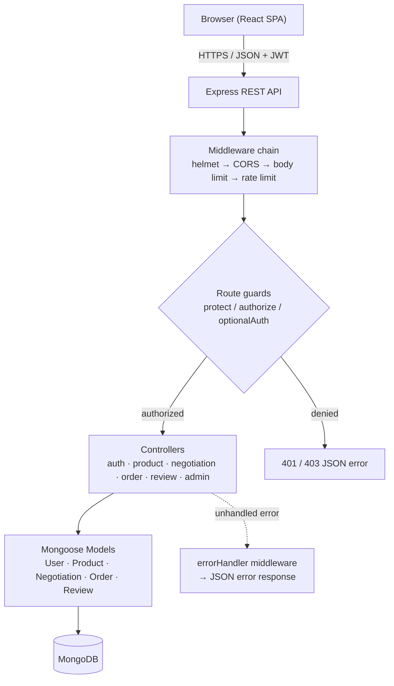
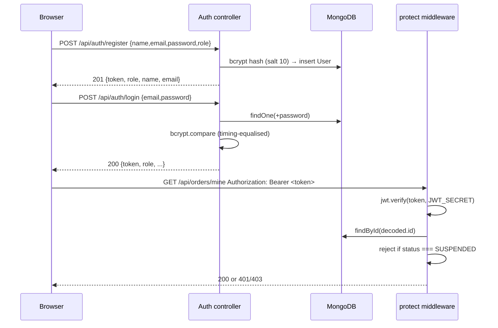

# NearDeal — System Architecture

This document describes the architecture that **actually exists** in the code
base. Nothing here is aspirational.

---

## 1. High-level data flow



Written linearly:

```
React frontend
      ↓  HTTP JSON  +  Authorization: Bearer <JWT>
Express REST API
      ↓
Authentication / Authorization middleware
      ↓
Controllers (business rules)
      ↓
Mongoose Models (schema + validation)
      ↓
MongoDB
```

---

## 2. Frontend layer

| Piece | File | Responsibility |
| --- | --- | --- |
| Entry point | `frontend/src/main.jsx` | Mounts the React app |
| Router | `frontend/src/routes/AppRoutes.jsx` | Declares every public/protected route |
| Route guard | `frontend/src/components/router/ProtectedRoute.jsx` | Redirects unauthenticated or wrong-role visitors to the right login |
| Session + cart state | `frontend/src/context/AuthContext.jsx` | JWT storage, login/register, cart, negotiations, orders |
| HTTP client | `frontend/src/services/api.js` | One `request()` helper: attaches the JWT, parses JSON, normalises errors |
| Pages | `frontend/src/pages/{customer,seller,admin,auth}` | Role-specific screens |

**Storage used by the browser:**

| Key | Where | Holds |
| --- | --- | --- |
| `neardeal_token` | `localStorage` | JWT |
| `neardeal_auth_user` | `localStorage` | Cached session profile for first paint |
| `neardeal_cart` | `sessionStorage` | Cart lines (cleared when the tab closes) |

Negotiation and order state are **never** cached in the browser — every read
goes to the API.

The client speaks to the API at `VITE_API_URL`, falling back to
`http://localhost:5000/api`.

---

## 3. Backend layer

`backend/server.js` wires the application in a fixed order:

| # | Stage | What it does |
| --- | --- | --- |
| 1 | `dotenv.config()` | Loads `backend/.env` |
| 2 | **Fail-fast secret check** | Exits with `FATAL` if `JWT_SECRET` is unset; warns if shorter than 32 chars |
| 3 | `connectDB()` | Opens the Mongoose connection |
| 4 | `helmet()` | Sets secure HTTP headers |
| 5 | `cors()` | Localhost always allowed; other origins must be listed in `CORS_ORIGIN` |
| 6 | `express.json({ limit: '256kb' })` | Parses JSON with an explicit payload cap |
| 7 | `rateLimit(...)` | Applied only to `/api/auth/login` and `/api/auth/register` |
| 8 | Route mounting | `/api/auth`, `/api/products`, `/api/negotiations`, `/api/orders`, `/api/reviews`, `/api/admin` |
| 9 | `GET /api/health` | `200` only when `mongoose.connection.readyState === 1`, otherwise `503` |
| 10 | `/api` 404 handler | Returns JSON, not Express' default HTML page |
| 11 | `errorHandler` | Final catch-all, always answers JSON |

**Layer responsibilities:**

```
routes/         URL → handler mapping + role guards
controllers/    business rules, validation, response shaping
models/         schema definitions, indexes, hashing hooks
middleware/     authMiddleware (protect/authorize/optionalAuth),
                rateLimit, errorHandler
config/db.js    MongoDB connection
```

Controllers never talk to the database directly through raw drivers — every
read/write goes through a Mongoose model.

---

## 4. Authentication (JWT)



Facts from the code:

- Tokens are signed with `process.env.JWT_SECRET` and expire in **30 days**.
- Passwords are hashed with **bcrypt**, 10 salt rounds, in a `pre('save')` hook.
  The `password` field is `select: false`, so it is never returned by a query.
- Self-service registration may only create `CUSTOMER` or `SELLER`
  (`SELF_SERVICE_ROLES`). An `ADMIN` account cannot be created through the API.
- Login compares against a dummy bcrypt hash when the e-mail does not exist, so
  a missing account and a wrong password take the same time.
- A suspended account is rejected on **every** request by `protect`, not merely
  at login, so revoking access does not wait for the 30-day token to expire.

### The three guards

| Guard | Behaviour | Used by |
| --- | --- | --- |
| `protect` | Requires a valid, non-suspended session; 401 otherwise | Most write routes and personal reads |
| `authorize(...roles)` | Runs **after** `protect`; 403 if the role is not allowed | Role-scoped routes |
| `optionalAuth` | Attaches `req.user` **if** a valid token is present, never rejects | `GET /api/products/:id` — the detail page must work for anonymous visitors yet still let the owner see a delisted listing |

`/api/admin` applies `protect` + `authorize('ADMIN')` **once** with `router.use`,
so a new admin route cannot be added without a guard.

---

## 5. Authorisation model

| Role | Frontend routes | Backend capability |
| --- | --- | --- |
| `CUSTOMER` | `/`, `/products`, `/cart`, `/orders`, `/negotiations` | Browse, open offers, checkout, own orders |
| `SELLER` | `/seller`, `/seller/negotiations` | Product CRUD, respond to offers, own orders, advance order status |
| `ADMIN` | `/admin` | Metrics, user/product/review moderation, all orders |

Ownership is always re-checked server-side from the database document, never
trusted from the request body. Examples:

- A seller can only advance an order whose `seller` field equals their own id.
- A negotiation response is allowed only for its `customer` or `seller`.
- A checkout can only consume a negotiation whose `customer` is the caller.
- An order detail read is limited to its customer, its seller, or an admin.

The frontend role strings are lower-cased (`customer`, `seller`, `admin`) for
routing; the API uses the upper-cased enum values (`CUSTOMER`, `SELLER`,
`ADMIN`). `AuthContext` converts between the two.

---

## 6. Error handling

`backend/middleware/errorHandler.js` is the single catch-all. It maps:

| Error shape | HTTP status |
| --- | --- |
| `CastError` (unparseable ObjectId) | `400` |
| `ValidationError` (schema) | `400` |
| Duplicate key `11000` | `409` |
| Malformed JSON body | `400` |
| Anything else | `500` |

Every response in the API — success or failure — is JSON with a `status` field
and, on failure, a `message` field the UI displays directly. Stack traces are
returned **only** when `NODE_ENV === 'development'`.

---

## 7. Cross-cutting security controls

| Control | Implementation |
| --- | --- |
| Password storage | bcrypt, `select: false` |
| Session tokens | JWT, 32+ char secret required to boot |
| Role enforcement | `protect` + `authorize` on every non-public route |
| Brute-force protection | Fixed-window in-memory rate limiter on login/register |
| Transport headers | `helmet()`; `x-powered-by` disabled |
| CORS | Localhost allowed by default; explicit allow-list otherwise |
| Payload size | 256 KB JSON cap |
| Server-side price trust | Checkout reads the price from the database, never from the browser |
| Idempotent checkout | Per-customer `requestId` unique index prevents double billing |
| Concurrent stock | Atomic `findOneAndUpdate` with a `stock >= qty` predicate |
| Input validation | Field-level validation in controllers; enums on every status field |

---

## 8. Where state lives

| State | Source of truth |
| --- | --- |
| Accounts, products, stock | MongoDB |
| Negotiations and offer history | MongoDB (`Negotiation.history[]`) |
| Orders and commission | MongoDB |
| Session JWT | Browser `localStorage` |
| Cart | Browser `sessionStorage` (client-side only — see limitations) |
| Admin KPIs | Computed live from MongoDB on each `/api/admin/metrics` call |

There is **no** Redis, message broker, WebSocket layer or caching tier. The
design is a single Node process talking directly to a single MongoDB — the
right amount of machinery for this application's scale.

---

## 9. Request lifecycle example

`POST /api/negotiations/offer` for an anonymous-looking failure path:

1. Browser sends `Authorization: Bearer <jwt>`.
2. Express runs helmet → CORS → JSON parser (rate limit does not apply here).
3. `negotiationRoutes` maps `POST /offer` to `createOffer` behind
   `protect` + `authorize('CUSTOMER')`.
4. `protect` verifies the JWT, loads the user, rejects `SUSPENDED`.
5. `authorize('CUSTOMER')` rejects a seller or admin with `403`.
6. `createOffer` validates ids and numbers, loads the product, and enforces the
   business rules (must be negotiable, sufficient stock, not the caller's own
   listing, no other active thread).
7. The document is written; `201` with the negotiation is returned.
8. Any throw is forwarded to `next(error)` → `errorHandler` → JSON error.

---

## 10. Related documents

- [`Database_Design.md`](Database_Design.md) — models, fields and relationships
- [`Bargaining_Workflow.md`](Bargaining_Workflow.md) — negotiation state machine
- [`API_Documentation.md`](API_Documentation.md) — endpoint reference
- [`System_Architecture.md`](System_Architecture.md) (this file)
